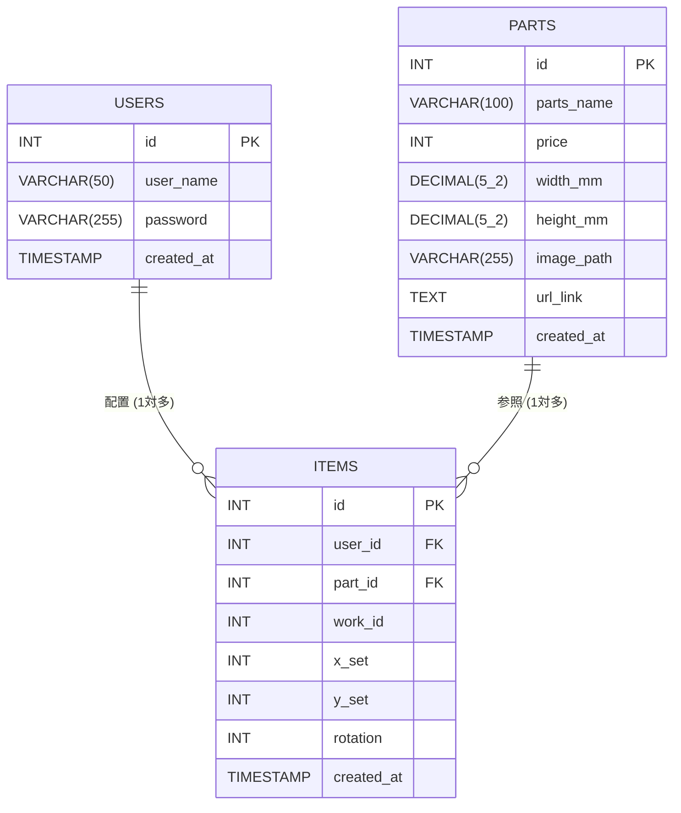

## テーブル設計
| テーブル名 | 役割とポイント |
| :-------- | :----- |
| `USERS` | ユーザーの基本情報を管理します。パスワードは生のままではなく、後ほどPHP側で暗号化して保存する仕組みにします。 |
| `PARTS` | システムで使えるパーツのカタログ（マスターデータ）です。ミリ単位のサイズを扱う `width_mm` と `height_mm` には小数を保存できる型（DECIMAL）を設定します。ここを独立させたことで、同じパーツの無駄な重複保存を防げます。 |
| `ITEMS` | キャンバスに置かれたパーツの履歴を管理します。`user_id` と `part_id`（外部キー）があるおかげで、「誰が」「どのパーツを」置いたのかが一瞬で見分けられます。新設した `work_id` により、複数のパーツを1つの作品としてグループ化できます。 |

### USERS テーブル（ユーザー情報）

| カラム名 | データ型 | キー | 説明 |
| :--- | :--- | :--- | :--- |
| `id` | INT | PK (主キー) | ユーザーの固有ID（自動連番） |
| `user_name` | VARCHAR(50) | - | ユーザーの表示名 |
| `password` | VARCHAR(255) | - | パスワード（暗号化して保存するため長めの枠を確保） |
| `created_at` | TIMESTAMP | - | アカウント作成日時 |

### PARTS テーブル（パーツのカタログデータ）

| カラム名 | データ型 | キー | 説明 |
| :--- | :--- | :--- | :--- |
| `id` | INT | PK (主キー) | パーツの固有ID（自動連番） |
| `parts_name` | VARCHAR(100)| - | パーツの名称 |
| `price` | INT | - | 価格（合計計算のため数字のみ保存） |
| `width_mm` | DECIMAL(5,2)| - | パーツの横幅（例: 12.50mm のように小数を保存） |
| `height_mm`| DECIMAL(5,2)| - | パーツの縦幅（例: 12.50mm のように小数を保存） |
| `image_path`| VARCHAR(255)| - | サーバーに保存した画像のファイルパス |
| `url_link` | TEXT | - | 通販サイトの購入先リンクURL |
| `created_at` | TIMESTAMP | - | データ登録日時 |

### ITEMS テーブル（キャンバス配置データ）

| カラム名 | データ型 | キー | 説明 |
| :--- | :--- | :--- | :--- |
| `id` | INT | PK (主キー) | 配置データの固有ID（自動連番） |
| `user_id` | INT | FK (外部キー)| 誰の配置データか（USERSテーブルのidと紐付け） |
| `part_id` | INT | FK (外部キー)| どのパーツか（PARTSテーブルのidと紐付け） |
| `work_id` | INT | - | どの作品に属しているか（作品ごとのグループ化に使用） |
| `x_set` | INT | - | キャンバス上のX座標 |
| `y_set` | INT | - | キャンバス上のY座標 |
| `rotation` | INT | - | パーツの回転角度 |
| `created_at` | TIMESTAMP | - | データ保存日時 |

### ER図

