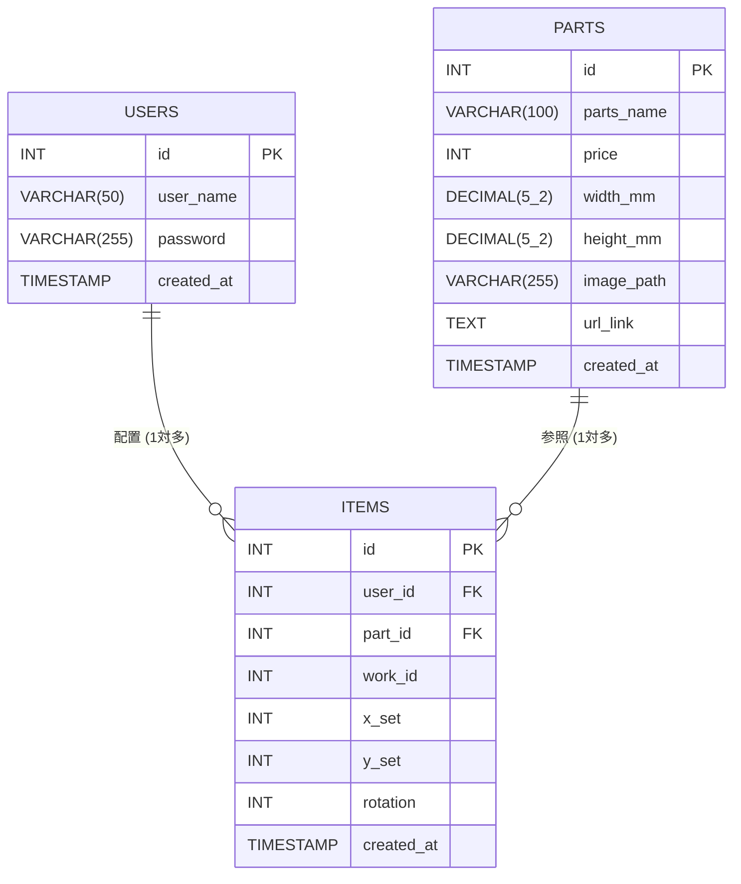

# Webアプリ「推しクラ」概要
[「推しクラ」発表資料（PDF）を開く](https://moeg3.github.io/D_m7_%E7%99%BA%E8%A1%A8%E8%B3%87%E6%96%99.pdf)


https://github.com/user-attachments/assets/02250b69-c78e-4116-bb64-bdbf00acbffe


## 1. コンセプト
* **アプリ名**: 推しクラ
* **テーマ**: 自分好みのカスタマイズで推し活をもっと便利に、楽しくするハンドメイドWebサービス

## 2. 開発の背景（ハンドメイドにおける課題）
同チーム内において、実際に行っているハンドメイド制作者の声を基に制作
* 実際にデザインしようとすると、思ったよりパーツの大きさが小さかった。
* パーツ購入にかかる合計金額を事前に知りたい。
* 欲しいパーツを見つけても、探すのが大変である。
* 他の人の作品を見て、パーツ購入の参考にしたい。

## 3. コア機能と特徴
上記の課題を解決するため、主に3つの機能を実装
* **実寸大の作品作り**: 実際のパーツと同じ比率でキャンバスに配置・制作ができ、サイズ感が分かりやすくなっています。
* **すぐに作品制作が行える環境**: パーツを選択・配置するだけで使用パーツの合計金額が自動計算され、そのまま購入サイトへアクセス可能です。
* **他のユーザーと作品を共有**: ユーザー同士で作品を共有し、他のユーザーのデザインから新しいアイデアを得ることができます。

## 4. 主な画面構成
* **ホーム画面**: ユーザーの作品一覧を閲覧できます。
* **マイページ画面**: 自身が作成・保存した作品の一覧を管理できます。
* **作業キャンバス画面**: konva.jsを利用して実装されており、パーツ一覧から好みのパーツを配置しながら合計金額を確認できます。
* **作品詳細画面**: 作品に使用されているパーツの内訳（個数・単価）と合計金額が表示され、「パーツを購入」ボタンから直接購入画面へ遷移できます。

## 5. 今後の展望
* **推し活市場の拡大への対応**: 約1940万人、約4.1兆円規模に拡大している推し活市場(2026)に向け、SNS等で広がるオリジナルの推し表現をサポート。
* **パーツ充実度の拡大（外部サイト連携）**: 現在のパーツは暫定的なものですが、将来的には「minne」や「Creema」などのハンドメイド向けパーツ購入サイトと連動することで、購入時の疑問解消や体験向上を目指す。

# 開発環境構築ガイド（Docker）

GitHub上のプロジェクトを自分のPC（ローカル環境）にダウンロードし、Dockerを使って開発環境を立ち上げるためのガイドです。
これにより、あなたのPC上でwebアプリを立ち上げることができます！

## 1. 事前準備（必要なソフトのインストール）

以下の2つのソフトウェアがインストールされているか確認し、ない場合はリンク先からダウンロードおよびインストールしてください。

* **Docker Desktop**: コンテナ環境を動かすための基本ソフト
  * [公式サイトからダウンロード](https://www.docker.com/products/docker-desktop/)
  * ※ インストール完了後、Docker Desktopのアプリを起動した状態にしておいてください。
* **Git**: GitHubからソースコードを取得するためのツール
  * [公式サイトからダウンロード](https://git-scm.com/downloads)

## 2. プロジェクトの取得と初期設定

ターミナル（Windowsの場合はPowerShell、Macの場合はターミナル）を開き、以下のコマンドを順番に実行します。

1. **GitHubからプロジェクトをダウンロードする**
   ```bash
   git clone https://github.com/moeg3/m7_teamD
   ```

2. **ダウンロードしたフォルダに移動する**
   ```bash
   cd <ダウンロードしたフォルダ名>
   ```

3. **環境変数（.env）ファイルを用意する**
   * データベースのパスワードなどを含む `.env` ファイルをフォルダ直下に作成してください。
   * ※ チーム内で `.env.example` などの雛形を用意している場合は、それをコピーして `.env` に名前を変更します。

## 3. 環境の構築と起動

準備が整ったら、Dockerコマンドを使ってサーバーやデータベースを一括で立ち上げます。

1. **コンテナをビルドしてバックグラウンドで起動する**
   ```bash
   docker compose up -d --build
   ```
   * ※ 初回は各ソフトのダウンロードと構築が行われるため、完了までに数分程度かかります。

2. **起動状況を確認する**
   ```bash
   docker compose ps
   ```
   * リストに `php-apache` や `db` が表示され、Statusが `Running`（または `Up`）になっていれば成功です。

## 4. 動作確認と終了手順

ブラウザを開き、以下のURLにアクセスしてアプリが正しく動いているか確認します。

* **Webアプリ画面:** `http://localhost:8082` （※環境に合わせてポート番号を変更してください）
* **データベース管理 (phpMyAdmin):** `http://localhost:8083`

**【作業を終了して環境を閉じる場合】**
ターミナルで以下のコマンドを実行すると、コンテナが安全に停止・削除されます。
```bash
docker compose down
```
※ 再度作業を始める時は、同じフォルダで `docker compose up -d` を実行するだけで即座に環境が復元します。

# テーブル設計
| テーブル名 | 役割とポイント |
| :-------- | :----- |
| `USERS` | ユーザーの基本情報を管理します。パスワードは生のままではなく、後ほどPHP側で暗号化して保存する仕組みにします。 |
| `PARTS` | システムで使えるパーツのカタログ（マスターデータ）です。ミリ単位のサイズを扱う `width_mm` と `height_mm` には小数を保存できる型（DECIMAL）を設定します。ここを独立させたことで、同じパーツの無駄な重複保存を防げます。 |
| `ITEMS` | キャンバスに置かれたパーツの履歴を管理します。`user_id` と `part_id`（外部キー）があるおかげで、「誰が」「どのパーツを」置いたのかが一瞬で見分けられます。新設した `work_id` により、複数のパーツを1つの作品としてグループ化できます。 |

### USERS テーブル（ユーザー情報）

| カラム名 | データ型 | キー | 説明 |
| :--- | :--- | :--- | :--- |
| `id` | INT | PK (主キー) | ユーザーの固有ID（自動連番） |
| `user_name` | VARCHAR(50) | - | ユーザーの表示名 |
| `password` | VARCHAR(255) | - | パスワード（暗号化して保存するため長めの枠を確保） |
| `created_at` | TIMESTAMP | - | アカウント作成日時 |

### PARTS テーブル（パーツのカタログデータ）

| カラム名 | データ型 | キー | 説明 |
| :--- | :--- | :--- | :--- |
| `id` | INT | PK (主キー) | パーツの固有ID（自動連番） |
| `parts_name` | VARCHAR(100)| - | パーツの名称 |
| `price` | INT | - | 価格（合計計算のため数字のみ保存） |
| `width_mm` | DECIMAL(5,2)| - | パーツの横幅（例: 12.50mm のように小数を保存） |
| `height_mm`| DECIMAL(5,2)| - | パーツの縦幅（例: 12.50mm のように小数を保存） |
| `image_path`| VARCHAR(255)| - | サーバーに保存した画像のファイルパス |
| `url_link` | TEXT | - | 通販サイトの購入先リンクURL |
| `created_at` | TIMESTAMP | - | データ登録日時 |

### ITEMS テーブル（キャンバス配置データ）

| カラム名 | データ型 | キー | 説明 |
| :--- | :--- | :--- | :--- |
| `id` | INT | PK (主キー) | 配置データの固有ID（自動連番） |
| `user_id` | INT | FK (外部キー)| 誰の配置データか（USERSテーブルのidと紐付け） |
| `part_id` | INT | FK (外部キー)| どのパーツか（PARTSテーブルのidと紐付け） |
| `work_id` | INT | - | どの作品に属しているか（作品ごとのグループ化に使用） |
| `x_set` | INT | - | キャンバス上のX座標 |
| `y_set` | INT | - | キャンバス上のY座標 |
| `rotation` | INT | - | パーツの回転角度 |
| `created_at` | TIMESTAMP | - | データ保存日時 |

### ER図


